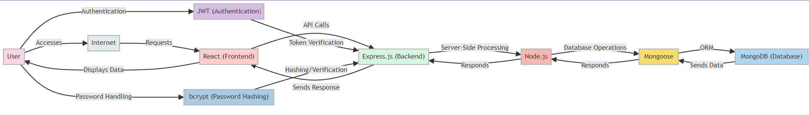

# VT Course Insights

This MERN stack web application is designed to assist Virginia Tech students in making informed decisions about their course enrollments for upcoming semesters. By providing access to historical data on departments, courses, and instructors, the application empowers students to consider various factors such as GPA trends, enrollment numbers, and withdrawal rates before finalizing their class schedules. The data spans a period of five years (2018-2023), offering a comprehensive overview of academic performance and trends at Virginia Tech. This user-friendly platform aims to simplify the course selection process, making it more data-driven and tailored to each student's academic needs and goals.

## Table of Contents

- [Software Architecture](#software-architecture)
- [ER Diagram](#er-diagram)
- [Installation](#installation)
- [Scripting](#scripting)
- [Usage](#usage)
- [User Authentication](#user-authentication)

## Software Architecture



## ER Diagram


## Installation

Follow these steps to set up Course Crafters on your local environment:

1. **Install Dependencies**:
   - Ensure you have **Python**, **Node.js**, and **MongoDB** (including MongoDB Compass) installed. If not, download and install them from their official websites.

2. **Set Up MongoDB**:
   - Open MongoDB Compass and create a new database named `CourseCrafterDB`.
   - Within this database, create a collection named `user`.

3. **Clone the Repository**:
   - Use git to clone the Course Crafters repository:
     ```bash
     git clone https://github.com/uehlingeric/CourseCrafters.git
     ```

4. **Create Environment Variables**:
   - Navigate to the cloned repository's root directory.
   - Create a `.env` file and add the following lines:
     ```
     MONGODB_URI=mongodb://127.0.0.1/CourseCrafterDB
     JWT_SECRET=your_secret_string_here
     ```
     Replace `your_secret_string_here` with any long string of your choice.

5. **Install Python Packages and Import Data**:
   - Change directory to `scripts`:
     ```bash
     cd scripts
     ```
   - Install required Python packages:
     ```bash
     pip install pandas bcrypt pymongo
     ```
   - Run the import script:
     ```bash
     python import.py
     ```

6. **Set Up Node.js Server**:
   - Return to the root directory:
     ```bash
     cd ..
     ```
   - Install Node.js packages:
     ```bash
     npm install
     ```
   - Start the Node.js server:
     ```bash
     node server.js
     ```

7. **Set Up and Run the Client**:
   - Open a second terminal.
   - Navigate to the `client` directory:
     ```bash
     cd client
     ```
   - Install necessary packages:
     ```bash
     npm install
     ```
   - Start the client application:
     ```bash
     npm start
     ```

Follow these steps in order to successfully set up and run the Course Crafters application on your local machine.


## Scripting

The data pipeline for Course Crafters involves a series of Python scripts, each designed for specific stages in data processing and database preparation, aligning with the following database schema:

### Database Schema Overview
The schema consists of several collections, each with distinct fields:

- **Dept**: Stores department data with fields like `dept_id`, `gpa`, `past_classes`, `unique_classes`, `new_classes`, and `title`.
- **Course**: Contains course information such as `course_id`, `dept`, `title`, `credits`, `gpa`, `enrollment`, `withdraw`, `past_classes`, and `new_classes`.
- **Instructor**: Holds instructor details, including `instructor_id`, `last_name`, `dept`, `gpa`, `enrollment`, `withdraw`, `past_classes`, and `new_classes`.
- **PastInstance**: Tracks past instances of courses with fields like `instance_id`, `course_id`, `instructor_id`, `year`, `term`, `crn`, `gpa`, `withdraw`, and `enrollment`.
- **NewInstance**: For upcoming course instances, containing fields such as `crn`, `dept`, `course_id`, `instructor_id`, `title`, `modality`, `credits`, `capacity`, `days`, `start_time`, `end_time`, and `location`.
- **InstructorCourseStats**: Aggregates instructor-course statistics with fields like `stat_id`, `course_id`, `instructor_id`, `gpa`, `enrollment`, `withdraw`, and `past_classes`.
- **User**: Manages user accounts, including fields like `_id`, `username`, `password`, `role`, and `schedule`.

### Script Execution Order and Details

1. **scraper.py**
   - **Purpose**: Scrapes current course offerings.
   - **Operation**: Extracts data for the `NewInstance` collection including course IDs, titles, instructors, and schedule details.
   - **Data Handled**: Course offerings and related details.

2. **past_cleaner.py**
   - **Purpose**: Cleans historical course and instructor data.
   - **Operation**: Formats and standardizes data for the `PastInstance` and `Instructor` collections.
   - **Data Handled**: Historical data for courses and instructors.

3. **new_cleaner.py**
   - **Purpose**: Cleans and formats newly scraped data.
   - **Operation**: Prepares recent data for the `NewInstance`, `Course`, and `Instructor` collections.
   - **Data Handled**: Recent course offerings and instructor details.

4. **increment.py**
   - **Purpose**: Updates records with new instances.
   - **Operation**: Increments `new_classes` counts in `Dept`, `Course`, and `Instructor` collections.
   - **Data Handled**: Counter updates for new class instances and instructors.

5. **import.py**
   - **Purpose**: Imports data into MongoDB.
   - **Operation**: Inserts processed data into respective collections and sets up initial user accounts in the `User` collection.
   - **Data Handled**: All cleaned and aggregated data across collections.

Follow this order to ensure the integrity and consistency of the data, crucial for the successful operation of the Course

## Usage

This application serves as a dynamic platform for managing and exploring academic department information, including detailed views of courses, instructors, and schedules. Here's how users can navigate and utilize the different components of the application:

### Department List

- **View Departments:** Users can browse through a list of all departments. This list can be sorted and filtered based on department attributes like department ID and title.
- **Access Department Details:** By clicking on a department, users are directed to a detailed view of that department.

### Department Detail

- **Course and Instructor Tabs:** Within the detail page of a department, users can switch between two tabs:
  - The **Courses** tab displays a list of courses offered by the department. Each course in the list links to its respective Course Detail page.
  - The **Instructors** tab shows a list of instructors associated with the department. Each instructor in the list links to their respective Instructor Detail page.

### Course Detail

- **Detailed Course Information:** This page provides comprehensive information about a specific course. It includes tabs for:
  - **New Instances:** Upcoming instances of the course.
  - **Past Instances:** Historical data of the course offerings.
  - **Instructor Course Stats:** Aggregated statistics related to the course's instructors.

### Instructor Detail

- **In-depth Instructor Information:** This page focuses on individual instructors, offering detailed information through tabs:
  - **New Instances:** Upcoming courses being taught by the instructor.
  - **Past Instances:** Courses previously taught by the instructor.
  - **Instructor Course Stats:** Statistical data about the courses taught by the instructor.

### User Schedule

- **View and Modify Schedule:** Authenticated users can view their upcoming schedule, which includes courses they plan to enroll in. They have the option to add or remove new courses from their schedule.

### User Authentication

- **Registration and Login:** Users can sign up for an account and log in to the application. Logged-in users can change their password and, if granted admin rights, create new admin accounts.

### Frontend Interaction with Backend

- The frontend interacts with the backend through RESTful APIs, using Axios for HTTP requests to various endpoints to retrieve and send data.
- User authentication is managed using JSON Web Tokens (JWT). Upon logging in, the backend validates the credentials and issues a JWT, which is then used for authenticating subsequent requests.
- Passwords are securely managed using bcrypt, ensuring they are hashed before storage and securely compared during login.
- React state and context are utilized to manage the application's state and user authentication status across different components.

This application offers a user-friendly interface for accessing and managing detailed departmental, course, and instructor information, making it a valuable resource for students, faculty, and administrative staff.

## User Authentication

This project implements a secure user authentication system. The system allows users to register, log in, change their password, and, for admin users, create new admin accounts. Below is an overview of how the authentication process works:

### Overview of JWT and bcrypt

- **JWT (JSON Web Tokens):** JWTs are used to securely transmit information between parties as a JSON object. In this project, JWTs are used to manage user sessions after authentication. When a user logs in, they receive a token that is used to authenticate subsequent HTTP requests to the server. This token ensures that the requests are made by an authenticated user.

- **bcrypt:** bcrypt is a password-hashing function. In this project, bcrypt is used to hash user passwords before they are stored in the database. When a user logs in, bcrypt is used again to compare the hashed version of the entered password with the hash stored in the database. This approach enhances security by ensuring that actual passwords are not stored in the database.

### Registration

- Endpoint: `/api/user/register`
- Method: `POST`
- Payload: `{ username: String, password: String }`
- Description: New users can register by providing a unique username and a password. The password is hashed before being stored in the database for security.

### Login

- Endpoint: `/api/user/login`
- Method: `POST`
- Payload: `{ username: String, password: String }`
- Description: Registered users can log in using their username and password. Upon successful login, a JSON Web Token (JWT) is generated and returned to the user. This token is used for subsequent requests to authenticate the user.

### Change Password

- Endpoint: `/api/user/changePassword`
- Method: `POST`
- Headers: `{ Authorization: Bearer Token }`
- Payload: `{ oldPassword: String, newPassword: String }`
- Description: Allows authenticated users to change their password. Users must provide their old password for verification and a new password.

### Create Admin (Admin only)

- Endpoint: `/api/user/createAdmin`
- Method: `POST`
- Headers: `{ Authorization: Bearer Token }`
- Payload: `{ username: String, password: String }`
- Description: This endpoint is restricted to admin users. It allows an admin to create a new admin account by providing a username and password.

### Frontend Implementation

The frontend interacts with these endpoints through forms and fetch requests. React state and context are used to manage user authentication status and roles across the application.

## Credits

Eric: Frontend and Backend Implementation.
Gandi: UI and Design Implementation.
